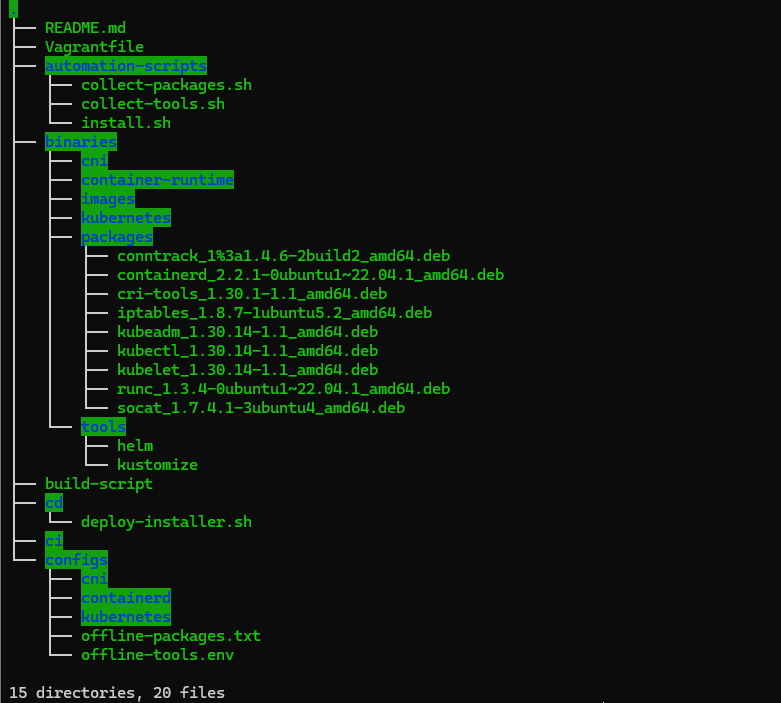
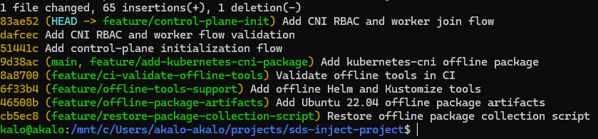

# SDS Inject

SDS Inject builds an **offline-style single-run installer** that creates a Kubernetes cluster on an existing Debian-based Linux system.

The goal is to run one installer file that contains scripts, binaries, configuration, offline packages, and helper tools required to bootstrap Kubernetes according to the assignment requirements.

---

<details open>
<summary>Project Goal</summary>

This project creates a self-running Kubernetes installer package.

The installer supports:

- Control-plane installation
- Worker node join flow
- Offline `.deb` package installation
- Bundled helper tools: `kubectl`, `helm`, and `kustomize`
- Safety checks before installation
- CI validation
- CD deployment script
- Recovery logic for incomplete `kubeadm init` flows
- Evidence-based validation on a two-node lab cluster

The final output is a single `.run` installer created with `makeself`.

</details>

---

<details>
<summary>Version and Environment Choices</summary>

The project targets Debian-based systems because the assignment is focused on Debian, Ubuntu, and Linux Mint style environments.

Ubuntu Server 22.04 LTS was selected for validation because it is a stable and common server baseline for Kubernetes testing.

Kubernetes versions are pinned instead of using `latest`.  
This is important because `kubeadm`, `kubelet`, `kubectl`, the control-plane components, and the worker nodes must stay version-compatible.

All important versions are documented so the installer behavior is predictable between runs.

| Component    | Version                                      |
| ------------ | -------------------------------------------- |
| Target OS    | Ubuntu Server 22.04.5 LTS                    |
| Architecture | amd64                                        |
| Kubernetes   | v1.30.14                                     |
| kubeadm      | v1.30.14                                     |
| kubelet      | v1.30.14                                     |
| kubectl      | v1.30.14                                     |
| containerd   | 2.2.1                                        |
| Helm         | v3.15.4                                      |
| Kustomize    | v5.4.2                                       |
| makeself     | 2.5.0                                        |
| Vagrant      | Host test tool, not bundled in the installer |

</details>

---

<details>
<summary>Architecture Decisions</summary>

The installer is designed as an offline-style package.

Main decisions:

- `makeself` creates one self-running `.run` installer.
- `kubeadm` bootstraps Kubernetes.
- `containerd` is used as the container runtime.
- Offline `.deb` packages are stored under `binaries/packages`.
- Helper tools are stored under `binaries/tools`.
- Configuration files are stored under `configs`.
- Installation logic is kept in `automation-scripts/install.sh`.
- CD deployment logic is kept in `cd/deploy-installer.sh`.
- Guardrails prevent unsafe reinstallation of an existing control-plane.

The installer prepares:

- Kernel modules
- Kubernetes sysctl settings
- containerd configuration
- Kubernetes control-plane
- admin RBAC repair flow
- kubeadm post-init resources
- basic CNI bridge configuration
- worker join flow

</details>

---

<details>
<summary>Project Structure</summary>

```text
automation-scripts/     Installer and collection scripts
binaries/packages/      Offline Debian packages
binaries/tools/         Bundled helper tools
configs/                Package and tool manifests
cd/                     Deployment script
.github/workflows/      CI/CD workflows
docs/screenshots/       Validation screenshots
dist/                   Generated installer output
```



</details>

---

<details>
<summary>How to Build and Run</summary>

Build the installer:

```bash
bash ./build-script
```

Run control-plane dry-run:

```bash
SDS_LOG_DIR="$PWD/logs" ./dist/sds-inject-installer.run -- --role control-plane --dry-run
```

Run worker dry-run:

```bash
SDS_LOG_DIR="$PWD/logs" ./dist/sds-inject-installer.run -- --role worker --dry-run
```

Install the control-plane:

```bash
sudo env SDS_APISERVER_ADVERTISE_ADDRESS=192.168.56.120 \
  SDS_POD_CIDR=10.244.0.0/16 \
  ./dist/sds-inject-installer.run -- --role control-plane
```

Create a worker join command on the control-plane:

```bash
sudo kubeadm token create --print-join-command
```

Join a worker node:

```bash
sudo env SDS_KUBEADM_JOIN_COMMAND="<kubeadm join command>" \
  SDS_POD_CIDR=10.244.0.0/16 \
  ./dist/sds-inject-installer.run -- --role worker
```

Verify the cluster:

```bash
sudo KUBECONFIG=/etc/kubernetes/admin.conf kubectl get nodes -o wide
```

</details>

---

<details>
<summary>Safety Policy</summary>

The installer detects the current Kubernetes state before making changes.

| Detected state             | Behavior                                |
| -------------------------- | --------------------------------------- |
| No Kubernetes installation | Allows control-plane installation       |
| Worker node                | Allows worker reinstall or upgrade flow |
| Existing control-plane     | Refuses automatic reinstall             |
| Unknown Kubernetes state   | Refuses to continue                     |

This prevents accidental destruction of an existing control-plane.

</details>

---

<details>
<summary>CI/CD</summary>

The project includes GitHub Actions workflows for validation.

The CI flow validates:

- Shell syntax
- Installer dry-run flows
- Offline package manifest checks
- Offline helper tools
- Build process
- CD script validation
- Required installer functions for control-plane, CNI, RBAC, and worker join

The CD script supports deployment to a dedicated target machine over SSH.

For a clean machine, CD installs the control-plane only.  
For a detected worker node, CD can run the worker reinstall or upgrade flow.  
For an existing control-plane, CD refuses automatic reinstall.

</details>

---

<details>
<summary>Evidence</summary>

Offline packages included in the bundle:


Bundled helper tools:


Installer build:


Installer size:


Control-plane dry-run validation:


Worker dry-run validation:


Local CD dry-run validation:


Installed Kubernetes packages on the control-plane:


Final two-node Kubernetes cluster validation:


Final Git history:



<details>
<summary>Troubleshooting and Recovery Evidence</summary>

During validation, `kubeadm init` returned a non-zero exit code after creating partial control-plane resources.

The recovery process validated:

- `super-admin.conf` access
- admin RBAC repair
- kubeadm post-init resource repair
- final worker join success

Control-plane init failure captured during testing:


Super admin recovery validation:


Admin RBAC repair validation:


</details>

</details>

---

<details>
<summary>Limitations</summary>

This project is a validated lab implementation, not a production Kubernetes distribution.

Current limitations:

- Tested on Ubuntu Server 22.04 LTS using Vagrant and VirtualBox.
- The installer bundles Debian packages and helper tools, but does not yet bundle Kubernetes container images as OCI archives.
- The CNI implementation is a basic bridge CNI for lab validation.
- Production environments should use a production-grade CNI such as Calico, Cilium, or Flannel.
- HA control-plane setup is not included.
- Certificate rotation, backup, and upgrade automation are not fully implemented.

</details>

---

<details>
<summary>Official Sources</summary>

- Kubernetes kubeadm documentation: https://kubernetes.io/docs/setup/production-environment/tools/kubeadm/
- Kubernetes package repositories: https://pkgs.k8s.io/
- Kubernetes container runtimes documentation: https://kubernetes.io/docs/setup/production-environment/container-runtimes/
- containerd documentation: https://containerd.io/
- Helm documentation: https://helm.sh/docs/
- Kustomize documentation: https://kubectl.docs.kubernetes.io/references/kustomize/
- makeself project: https://github.com/megastep/makeself
- Vagrant documentation: https://developer.hashicorp.com/vagrant/docs

</details>
