# SDS Inject — Offline Kubernetes Installer


**SDS Inject** builds a self-contained, offline-style single-run installer (`.run`) that bootstraps a complete Kubernetes cluster on Debian-based Linux environments without requiring active internet access during deployment.

It encapsulates binaries, system packages, configuration files, CNI setups, and helper tools into a single executable generated via `makeself`, enforcing zero-trust safety checks and recovery logic.

---

## Architecture & Execution Flow

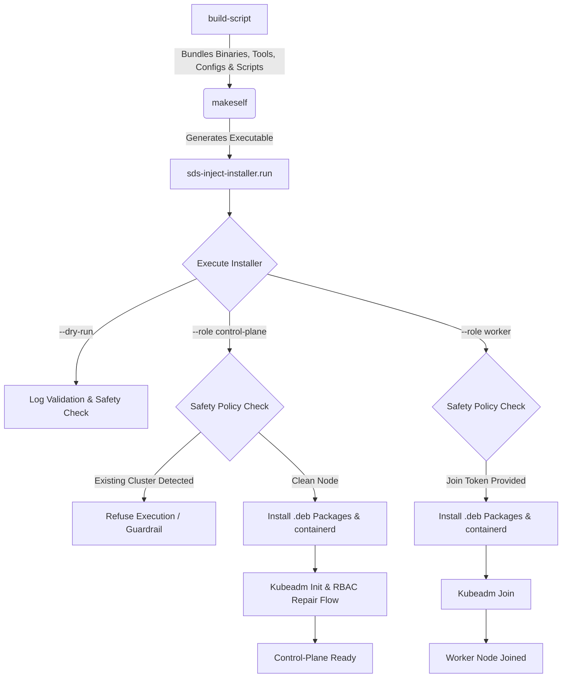

---

## Key Features

- **Air-Gapped Design:** Pre-bundles all required Debian packages (`.deb`) and essential tools (`kubectl`, `helm`, `kustomize`).
- **Single Executable Output:** Packages the entire installer into a portable `.run` binary using `makeself`.
- **Strict Guardrails & Safety Policy:** Automatic cluster-state detection prevents accidental overwrites or destruction of active control planes.
- **Dry-Run Mode:** Built-in `--dry-run` flag allows complete pre-execution validation and log checking without modifying the host system.
- **Resilient Recovery Logic:** Includes automated repair flows for incomplete `kubeadm init` executions, super-admin context validation, and RBAC recovery.
- **CI/CD Integrated:** Automated shell syntax testing, artifact validation, and SSH-based automated CD deployments via GitHub Actions.

---

## Environment & Version Matrix

To eliminate compatibility drift between `kubeadm`, `kubelet`, and container runtimes, all core component versions are strictly pinned:

| Component | Pinned Version | Note |
| :--- | :--- | :--- |
| **Target OS** | Ubuntu Server 22.04.5 LTS | Debian-based baseline |
| **Architecture** | `amd64` | x86_64 architecture |
| **Kubernetes Core** | `v1.30.14` | `kubeadm`, `kubelet`, `kubectl` |
| **Container Runtime** | `containerd` `2.2.1` | Configured with systemd cgroup driver |
| **Helm** | `v3.15.4` | Bundled in `binaries/tools` |
| **Kustomize** | `v5.4.2` | Bundled in `binaries/tools` |
| **Packaging Engine** | `makeself` `2.5.0` | Creates self-extracting archive |
| **Testing Harness** | Vagrant / VirtualBox | Multi-node local validation lab |

---

## Project Structure

```text
├── automation-scripts/   # Primary installation, recovery, and collection scripts
├── binaries/
│   ├── packages/         # Offline Debian (.deb) dependencies
│   └── tools/            # Pre-compiled helper binaries (kubectl, helm, kustomize)
├── configs/              # Kubeadm manifests, containerd configs, CNI definitions
├── cd/                   # Continuous Deployment SSH-based execution scripts
├── dist/                 # Generated .run installer artifacts
├── docs/screenshots/     # Execution logs and lab validation evidence
└── .github/workflows/    # CI/CD pipeline automation
```

---

## How to Build and Run

### 1. Build the Self-Contained Installer
```bash
bash ./build-script
```

### 2. Dry-Run Validation (Non-Destructive)
Verify the setup and check system pre-requisites:
```bash
# Control-plane dry-run
SDS_LOG_DIR="$PWD/logs" ./dist/sds-inject-installer.run -- --role control-plane --dry-run

# Worker dry-run
SDS_LOG_DIR="$PWD/logs" ./dist/sds-inject-installer.run -- --role worker --dry-run
```

### 3. Deploy Control-Plane
Run the installer on the primary node:
```bash
sudo env SDS_APISERVER_ADVERTISE_ADDRESS=192.168.56.120 \
  SDS_POD_CIDR=10.244.0.0/16 \
  ./dist/sds-inject-installer.run -- --role control-plane
```

### 4. Join Worker Nodes
Generate a join token on the control-plane:
```bash
sudo kubeadm token create --print-join-command
```
Execute on the worker node:
```bash
sudo env SDS_KUBEADM_JOIN_COMMAND="<kubeadm join command>" \
  SDS_POD_CIDR=10.244.0.0/16 \
  ./dist/sds-inject-installer.run -- --role worker
```

### 5. Verify Cluster Uptime
```bash
sudo KUBECONFIG=/etc/kubernetes/admin.conf kubectl get nodes -o wide
```

---

## Safety & Execution Policy

The installer performs state analysis on the target machine prior to applying any configurations:

| Detected Host State | Installer Action / Behavior |
| :--- | :--- |
| **No Kubernetes Detected** | Permits clean `--role control-plane` initialization. |
| **Worker Node Detected** | Allows worker re-join or state upgrade flow. |
| **Existing Control-Plane** | Refuses automatic reinstall to protect active workloads. |
| **Unknown/Corrupted State** | Halts execution immediately and prompts for manual review. |

---

## Real-World Incident Recovery Flow

During multi-node lab stress testing, an intentional edge case was validated where `kubeadm init` returned a non-zero exit code due to partial resource allocation. 

The installer's recovery architecture was validated through:
1. Detection of partial control-plane state via `/etc/kubernetes/super-admin.conf`.
2. Automated admin RBAC repair and control-plane privilege restoration.
3. Post-init resource patching ensuring cluster stability prior to worker join.

---

## CI/CD Pipeline

Automated by **GitHub Actions**:
- **Linting & Syntax:** Validates Shell script formatting via `shellcheck`.
- **Dry-Run Verification:** Verifies installer bundle extraction and `--dry-run` logic.
- **Package Manifest Integrity:** Checks presence and sha256 checksums of offline `.deb` packages and helper binaries.
- **CD Automated Deployment:** Triggers SSH deployment scripts to execute clean node installations or worker re-joins safely.

---

## Lab Validation & Evidence

### Offline Package & Tool Bundling
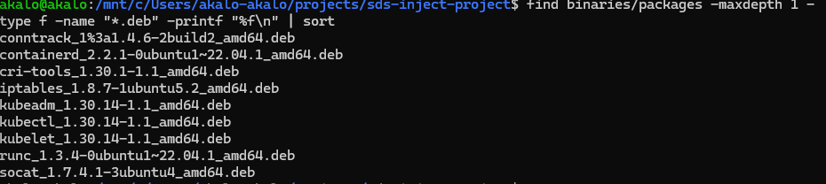
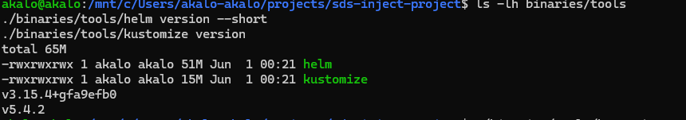

### Installer Build & Artifact Size
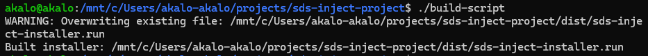
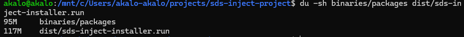

### Dry-Run Validations
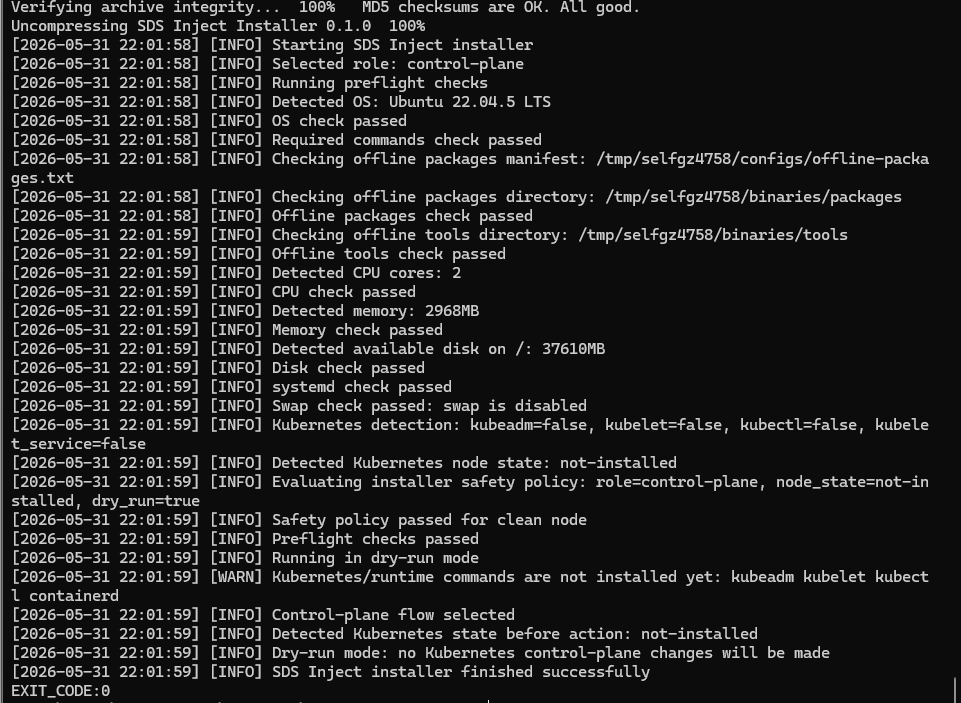
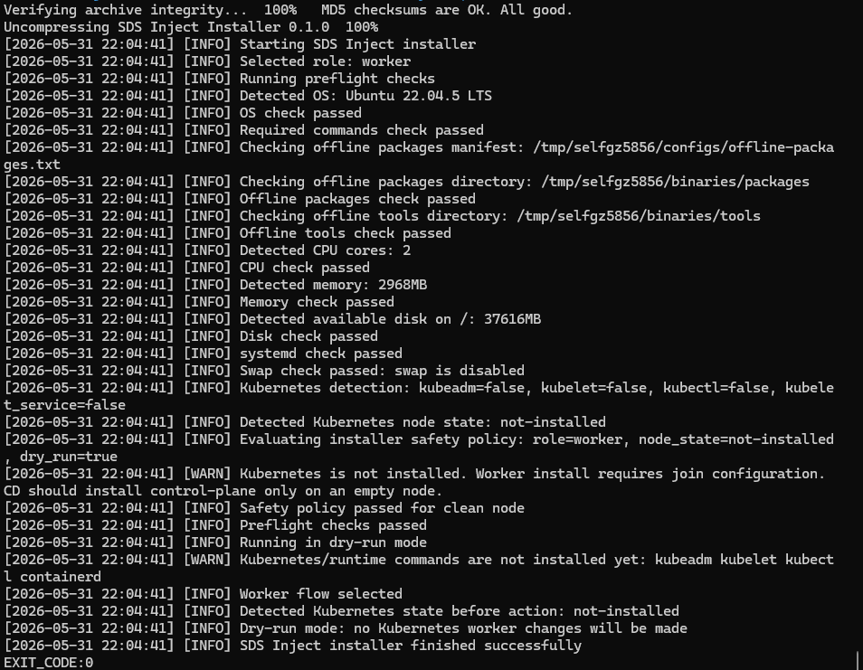
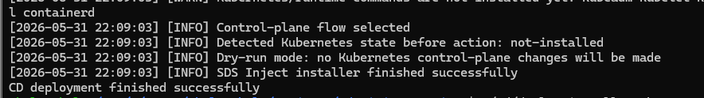

### Two-Node Cluster Operational Proof
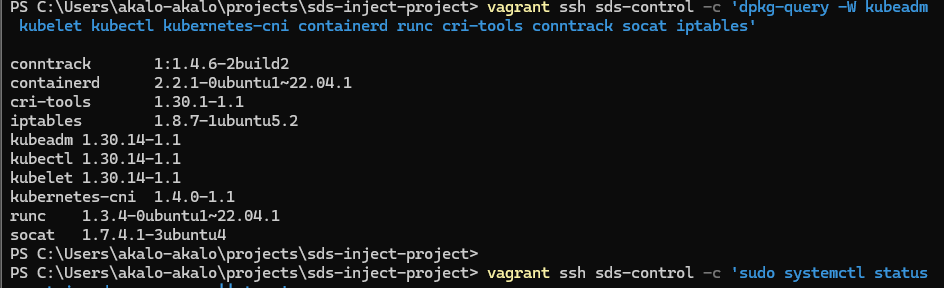
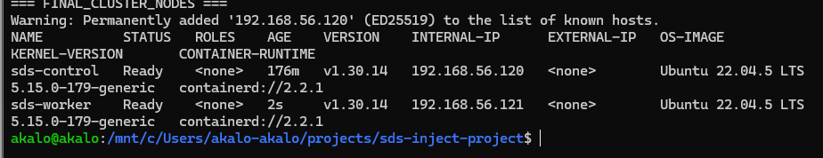

### Recovery Verification Evidence
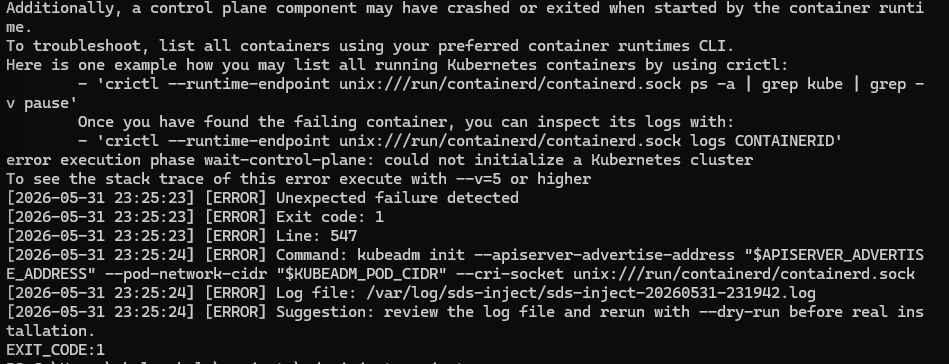
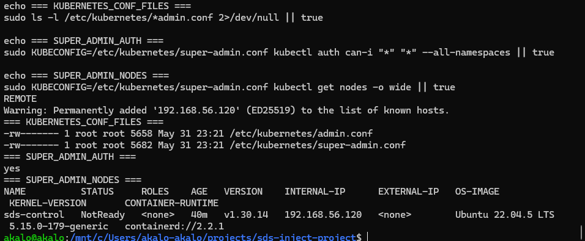
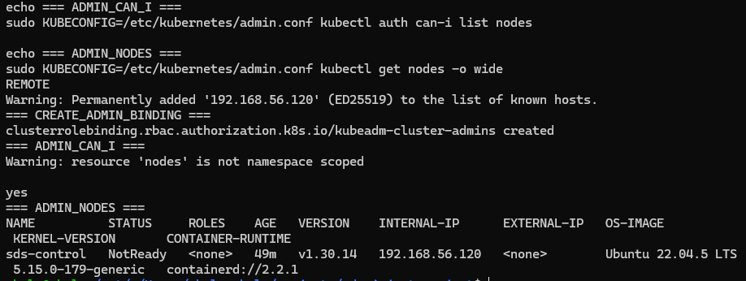

---

## Known Limitations & Future Roadmap

This project serves as a production-grade infrastructure lab and constraint-based installer demonstration.

- **Image Bundling:** Current version bundles system `.deb` packages; container images are pulled or pre-loaded separately.
- **CNI:** Implements a lightweight Bridge CNI for lab validation; production deployments are recommended to swap to Cilium or Calico.
- **High Availability (HA):** Multi-master control-plane setup and external etcd topology are not included in the current release.

---

## References & Docs

- [Kubernetes kubeadm Documentation](https://kubernetes.io/docs/setup/production-environment/tools/kubeadm/)
- [makeself GitHub Repository](https://github.com/megastep/makeself)
- [containerd System Engine Documentation](https://containerd.io/)
